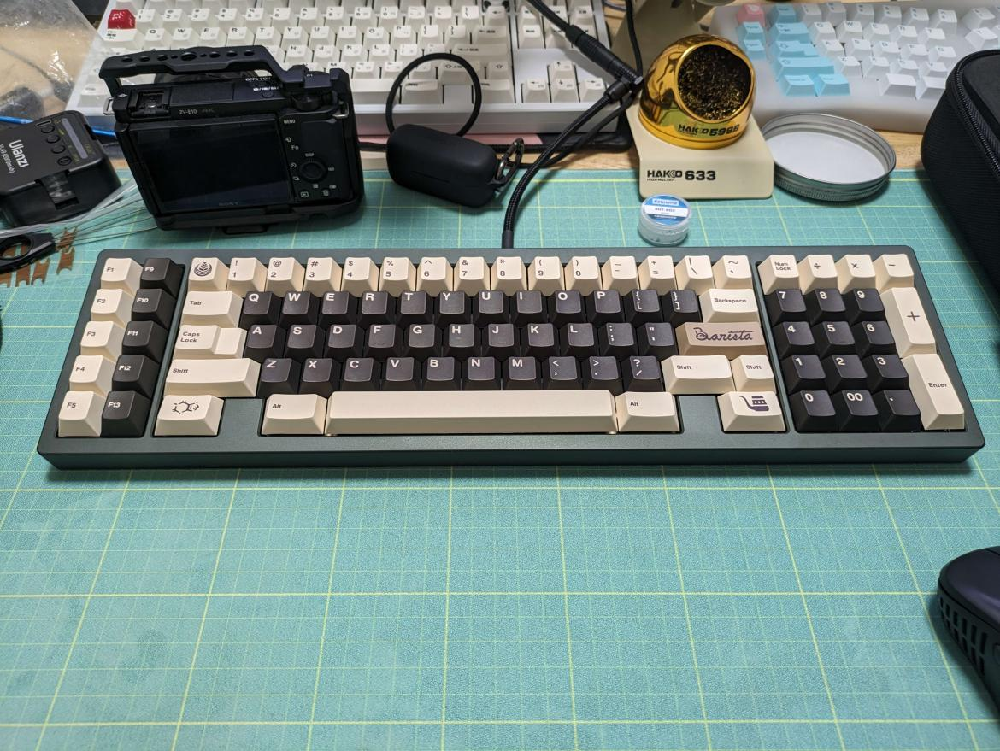

<!-- _class: lead -->
# Google PixelとAI

## 発表者: [L4Ph(Katsuyuki-Karasawa)](https://x.com/R0u9h)

---

<!-- _header: 自己紹介 -->
## 誰?

- キーボード/音響/自作PC/Vita Hack etcオタク
- LT会を開こうと提案して、実際はすべて投げた人
- sdwebuiの日本語化とか、RVCのContributor
  - 使ってくれてるひとがいたら嬉しい
- 社会人1年目
- 元遊舎工房の舎員 / 現一般エンジニア
  - あったことある人いるかもしれない

---

<!-- _class: lead -->
## はじめに
### Google LLCが嫌いな人挙手✋

---

## なにを話すの

割とタイトル通り

- 技術的なことはほとんどありません(雑魚エンジニアなので) = みんな分かる
- Google Pixel持ってる人がいたら、今後に期待してみると面白いかも
- 分からないことがあれば、[𝕏@R0u9h](https://x.com/R0u9h) へリプライどうぞ

---

## Google Pixelってなに

Googleが開発したスマホ

- Tensorという独自SoC(System on Chip)が搭載されたスマホ
- 最近もPixel 8 / 8 Proが発売された(Tensor G3)
- AOSPからほとんどカスタムされていないので使いやすい
- 日本のAOSP搭載スマホのシェアでは結構圧倒的
  - AOSP搭載のスマホだと3割くらいのシェア
- カスタムROM勢にも優しく、ROM焼きしてもFeliCaが消えない
  - [海外モデルにも日本基準でFeliCaが載ってる](https://github.com/jjyao88/unlock-felica-pixel) 👈えらい

---

## どこが独自SoCなの

いろいろ

- Googleが自社で設計して、(いまは)Samsungが製造
- (たぶん)Qualcomm依存からの脱却
- Edge [**TPU(Tensor Processing Unit)**](https://cloud.google.com/tpu) というのが載ってる 👈これ今日の話で重要
- そのため、Pixelでしかできないことがいくつかある
  - 消しゴムマジックとか、話題になりましたね

---

## TPU(Tensor Processing Unit)って?

### Googleが開発した機械学習用のプロセッサ

Nvidiaなら**A100** / **H100** / **X100**
AMDなら**Instinct**シリーズ
つまり、**すごいAIつよつよプロセッサ**
(を小型化したやつ)

---

## もう少し詳しく説明

- GCP(Google Cloud Platform)のCloud TPUで使用可能
- 演算精度の緩和(= 8bit/16bit)し、推論に特化
  - 推論の精度を犠牲に、データ量や消費電力が1/4、1/2に
- シストリックアレイ化により、データの高局所性化
  - よくやり取りするデータを近くに配置することで無駄を排除

シストリックアレイ化については以下が参考になるので読んでみてください

- [Google TPUを作ってみる～アーキテクチャ考察編～](https://qiita.com/arutema47/items/b7be3aacd3c0d467a469)
- [Computer Architecture 6th Editionの7章"Domain-Specific Architecture" を読む](https://msyksphinz.hatenablog.com/?page=1514998800)

---

---

## 主題

ここからはオタクの妄想を話すだけです。

---

## どういうものができそうなのか

- アップスケール
- フレーム補完
- Google製品とのインテグレーション向上
- pKVMの活用

他にもいくつかありますが、パッと思い浮かぶのだとこれくらい

---

## アップスケール

これは比較的分かりやすいと思います。  

- NVIDIAでいうDLSS  
- AMDでいうFSR  
- Qualcomm: Snapdragon GSR
- intel: XeSS

など。  

アップスケールを行うことで、ネイティブ解像度と比較して大幅に負荷が減少します。

---

## フレーム補完

現在のフレームから、次のフレームを推定することでフレームを生成
→生成したフレームを挿入することでFPSを向上

本来は専用のMEMCというチップが必要
代替としてTPUを使用することも可能性がありますし、MEMCチップのコストを大幅に減らすことができます。

AMD RadeonのFSR3から実装されているFluid Motionが同じ技術にあたる

---

## Google製品とのインテグレーション向上

これはもう楽に想像できる
GMSという世界最大とも言えるサービスを所有しており、これを活用しない手はありません。
すでに使用されている分野ですが、まだまだやれることはいくらでもあります。

GoogleはBardなんかを出していますが、そうではなくそれ以外に焦点を当ててみるのが楽しい

生成AIからは少し外れますが、

---

### たとえば

- Google翻訳/Gcamのオンデバイス精度向上
  - SST / TTS / OCRなどが集約されているので、活用しない手はない
- Google Mapのオフライン精度向上
  - オンラインのはもう十分だが、オフラインのマップはお世辞にもいいとは...
- 指紋認証/顔認証の精度向上
  - 以前はMotolora以外使いものにならなかったが、今はTPUの代用が効く
  - iPhoneでは昔から指紋認証を使う度に学習し、精度がよくなってた
- CPGPUクロック、プロセス、メモリ管理などの改善
  - CPGPUでないチップで行うことで、さらに省電力化を目指せるのでは?
  - バッテリー周りの直接/間接的な改善になる

---

## pKVMの活用

Android13以降のAOSPに**pKVM**(***p**rotected **K**ernel-based **V**irtual **M**achine*)がある
(LinuxのKVMとほぼ同じもの)

詳しいアーキテクチャは[この辺](https://source.android.com/docs/core/virtualization/architecture?hl=ja)

カスタムROM界隈では有名な[kdrag0n](https://kdrag0n.dev)が**NestBox**を作ったので、そのままUbuntuやArch Linux、はてには[Windows 11 Arm](https://x.com/kdrag0n/status/1492754683445669893?s=20)まで動かすことができる
(ついでにDOOMも動かしてる)

---

### それで?

OSの仮想化が可能になった
= そのKVM上であれば自由にいろいろと動かせる

たとえば[llama.cpp](https://github.com/ggerganov/llama.cpp)はTermux上で3.5token/sで動くが、これよりさらにネイティブに近い状態で動かせる  

中身はただのLinuxなので、StableDiffusionとかも動かせる

---
## 最後に

今年のqcomはSnapdragon 8G3、MediaTekはDimensity 9300などモバイル向けのSoCで、強力なAI向けの性能のチップを持つSoCを出してきた

もちろんこれらはオンデバイスの生成AIの概念を変えるし、できることも増える
ただ、エンドユーザーが扱えないことにはなんの価値も生み出さないし、オマケにしかならない可能性がある
(とくに彼らは半導体の設計/開発しかしないため)

エンドユーザーへもっとも使われているプロダクトを出しているのはGoogleだし、それらを支えるSoCがある。
OSもあれば、GMSというサービス、Playストアというプラットフォームもある。

---

GoogleのAI関連がそこまで強くないのかもと思った人は、1度スマホに入ってるGoogleのプロダクトを見直してほしい

また、そのプロダクトにAIを使ったときになにができるか、それができるとなにが改善されるか、などを考えるともっと幅が広がっていくのかなと思っています。

---

このスライドは

- Geonworks W1-AT Olive(Plateless + Tadpole)
- Saturn Studio Búri 神祖
- Milkeyway米可维外设 x Onekey Studio Barista

で書きました。

この後の交流会で試打できます!